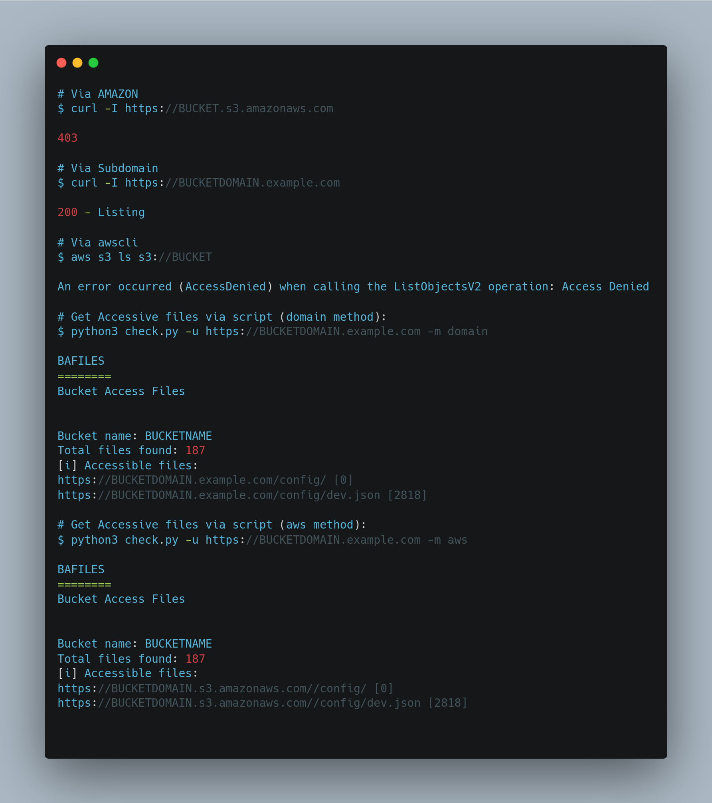

<h1 align="center">Bucket Access Files</h1>

<h4 align="center">List and fetch publicly accessible files from an exposed Amazon S3 bucket.</h4>

<p align="center">
  <a href="#about">About</a> •
  <a href="#install">Install</a> •
  <a href="#usage">Usage</a> •
  <a href="#license">License</a>
</p>

<p align="center">
  
  
  
  
</p>

## About

**Bucket Access Files** parses the XML listing of a public Amazon S3 bucket, enumerates every object key, and then checks which of those files are actually accessible. It can resolve files either through the bucket's native AWS endpoint (`https://<bucket>.s3.amazonaws.com/<key>`) or through a custom domain that fronts the bucket. For each reachable file it prints the URL and the response size, making it easy to spot exposed data during a bucket misconfiguration assessment.



## Install

```bash
git clone https://github.com/phor3nsic/bucketaccfiles
cd bucketaccfiles
pip install -r requirements.txt
```

## Usage

```bash
python3 check.py -m aws -b BUCKET_NAME
python3 check.py -m domain -u https://files.example.com/
```

| Flag | Description | Default |
|------|-------------|---------|
| `-m`, `--method` | How to test files: `domain` or `aws` (required) | — |
| `-b`, `--bucket` | Bucket name (used to build the S3 listing/URLs) | — |
| `-u`, `--url` | URL that returns the bucket's XML object listing | — |
| `-h`, `--help` | Show help | — |

## Examples

```bash
# Test files through the AWS S3 endpoint, by bucket name
python3 check.py -m aws -b my-public-bucket

# Test files served behind a custom domain, from its XML listing
python3 check.py -m domain -u https://cdn.example.com/
```

Example output:

```text
Bucket name: my-public-bucket
Total files found: 12
[i] Accessible files:
https://my-public-bucket.s3.amazonaws.com/config.json [842]
https://my-public-bucket.s3.amazonaws.com/backup.sql [10485]
```

## Disclaimer

For authorized security testing and education only. You are responsible for how you use it.

## License

[MIT](LICENSE) © [phor3nsic](https://github.com/phor3nsic)
